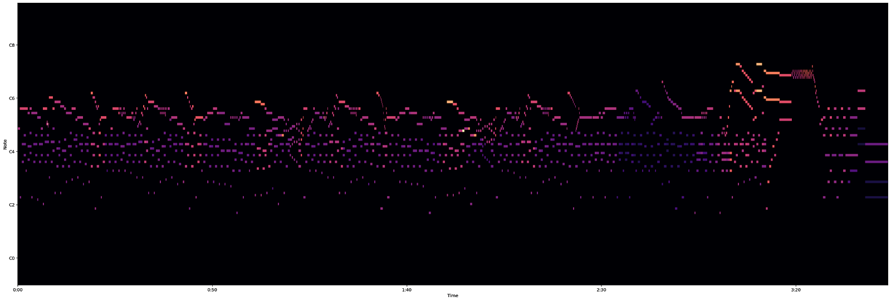
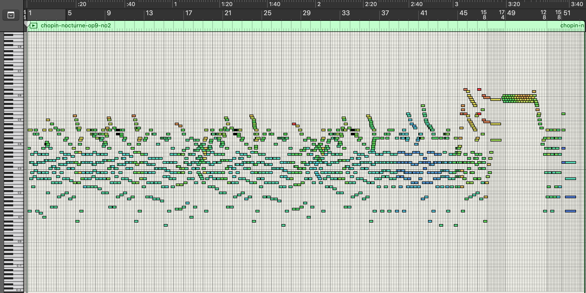
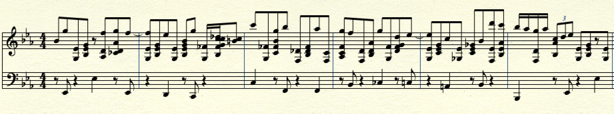
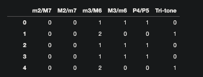
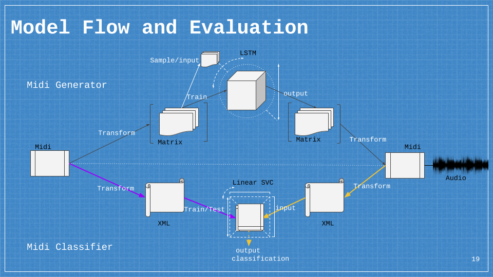
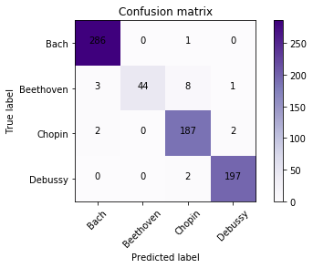
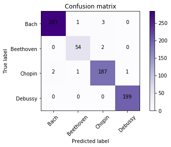
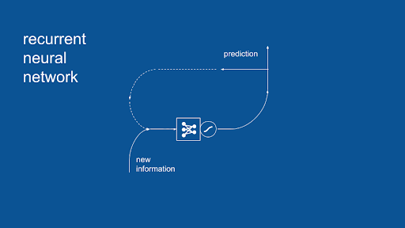
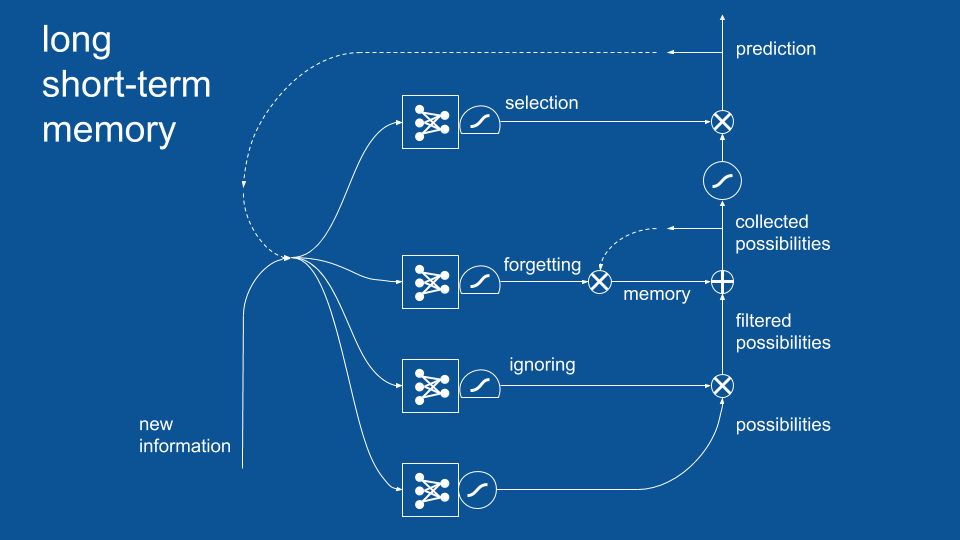

# Computational Music_box

## Summary

For this project I asked myself the age old question: Can AI generate new music?

The results of this project: 

1. Developed 5 LSTM models trained respectively on piano works by Bach, Beethoven, Chopin, Ravel and Debussy. The output was 3 minute piano works.
    
2. Developed a linear SVC as a second evaluation metric to double check the output composition's similarity to the respective composer each model was trained on. 

3. Modularized and importable composer bots that generate functional piano music and self grade their simularity to the actual composer. The music is output in both audio and sheet music once the scripts are run.  

## Brief History of AI music

Here I present two examples of AI music (although there have been many sense)

In 1957 the first work composed entirely by AI was a titled ‘Illiac Suite for String Quartet’ by Lejaren Hiller & Leonard Isaacson @ University of Illinois at Urbana-Champaign. Illiac stood for: Illinois Automatic Computer. The approach was based in an algorhithmic sequence programmed by the composer for the Illiac to perform. This method was an execution of a linear program.

It wasn't until the 1980s when 'Experiments in Musical Intelligence', developed by David Cope @ University of California, Santa Cruz was used. These were the first models to analyze existing music and generate new pieces using learned rules. This method used a non-linear training and generating process that recognized a rule based system, but added in an elememt of randomness. This allowed for model to generate new peices within a style 'on its own' rather than simply carrying out a set of instructions. 

## What the data is and how to visualize it

In this project I used MIDI Data to train both the LSTM and the linear SVC. MIDI stands for: Musical Insturment Digitial Interface. Essentially, MIDI is musical notation that a computer can interpret and render. Using PrettyMIDI to visualize the data, here is an example of Chopin's Op. 9 No. 2 in Eb. 

Above you can visualize the music notated, similarly to sheet music. However, rather than standard notation, this is more akin to something you would see in a DAW. DAW stands for: Digital Audio Workspace. Below is how MIDI is represented in an DAW on what is known as a piano roll. 

Additionally, below is the same data in the form of sheet music. In this image, only the first six bars are depicted.

## Retrieving the data

In order to obtain the data I scrapped three websites. 
    
    1. 'Classical Piano Page' 
    2. 'Midi World'
    3. 'Classical Archives'

From these websites I obtained 782 MIDI files.

    1. Bach (1685 - 1750) Baroque (287)
    2. Mozart (1756 - 1791) - Classical (43)
    3. Beethoven (1770 - 1827) - Classical -> Romantic (56)
    4. Chopin (1810 - 1849) - Romantic (191)
    5. Debussy (1862 - 1918) - Romantic (199)
    6. Ravel (1875 - 1937) - Romantic - > Modern (6)

## MIDI Data Analysis

What can we learn from MIDI data?

Analyzing MIDI data is the same process as analyzing sheet music. Using Music21 we are able to theoretically interperet the the MIDI. While I was exploring the data and analyzing the characterisitcs of of each composer, I particularly paid attention to: 

### Analysis of Harmonic Elements 
    - Key
    - Pitch Class
    - Pitch Sets
    - Forte Class
    - Interval Vector

### Examples of Harmonic Elements
    Key - C Major/A minor
    
    - Pitch Class
    0-11 where 0 = C, 1 = C#/Db, 2 = D, 3 = D#/Eb...etc	 
    
    - Pitch Set
        - C Maj chord = [C, E, G] = [0, 4, 7]
        - C Min chord = [C, Eb, G] = [0, 3, 7] 
            
        However, in PrimeForm, they are both = [0, 3, 7]

    - Interval Vector
        Vectorized interval qualities per set

Below is an example of interval vectors found within a musical corpus.  

Essentially, this dataframe depicts the sequence of chords occuring in a peice of music and and describes the quality of the chords by showing which intervals construct the chord. An interval vector can be thought of as anagolous to a word vector. Except rather than the vector describing the words that make up the sentences in the corpus, the vector describes the letters that construct the word. In the metaphor, chords are words, and chord progressions can be interpreted as sentences.

## Modeling

Below is an image of the basic Model flow. 

### Breakdown of MIDI transformation into Inputs

#### LSTM inputs

.png)

In the above example is a representation of the Ravel MIDI being tranformed into a matrix of (128,300). In this instance, the matrix is acting as a piano roll, where 0 - 127 represent the 128 notes found in the MIDI representation, where 0 = C @ octave -1 and 127 = G @ octave 9. 

The LSTM model interprets each column as a step in the sequence of the piece. It detects which pitch is being triggered within each step by a numerical indication of 1, 0 or 0.5 at a location along the y axis. 

    Pitch On = 1
    Continuation of Pitch = 0.5
    Rest or Pitch off = 0

Each matrix looks at the 300 steps at a time. The LSTM, however, uses every 15 steps of the matrix to predict the next. 

The three dimensional input for the LSTM takes in account the number of peices per composer, the number of pitches possible and the offset of each pitch. Duration of the pitch then becomes learned through the implication of whether or not the pitch is held or followed by a rest after being triggered.

#### Linear SVC inputs

.png)

In the above example is a representation of the Ravel MIDI being transformed into chord Ngrams. Each Ngram is represented by a number 0 - 191. To arrive at this number, I used the 16 most common chords and multiplied it against each pitch 0 - 11 of the twelve tone western harmonic system. This allows each of the 192 numbers to equal a unique chord. 

### Why Linear SVC? 

Simply put, the Linear SVC gave me the most accurate classification between composers. The reason behind this is because Support Vector Machines are great for recognizing relationships within data sets that have more features per data point than data points. In this instance, there were more chords and chord sequences per composer that corpuses per composer. This is similar to there being more words associated with an author than there are number of books. 

To evaluate the Linear SVC's accuracy, I tested the the following models as well:

    1. Logistic Regression:
        Fscores:
            Micro: 90.31%
            Macro: 81.97%
    2. KNeighbors: 
        Fscores:
            Micro: 87.04%
            Macro: 80.49%
    3. MultiNomialNB: 
        Fscores: 
            Micro: 87.86%
            Macro: 79.02%
    4. MLPClassifier:
        Fscores:
            Micro: 92.91%
            Macro: 87.24%

The classifiers were trained on Bach, Beethoven, Chopin and Debussy. Here is the accuracy of the Linear SVC using Chord Ngrams:

    Parameters: 
        Loss: ‘Hinge’
        Penalty: ‘L2’
    Fscores:
        Micro: 97.41%
        Macro: 95.4%

##### What Can We Take Away?

It is interesting to note that with Chord Ngrams alone, the classifier can recognize Beethoven perfectly. The errors occured mostly in confusing Chopin as Beethoven. Speculating why the classifier might make these errors, it would be interesting to use a musicological lens and see when each composer was alive; did they cross paths or have influence on one another? Further, what effect did each composer have on the musical style of their era? and vice versa, how did the era have an effect on their personal style?

#### Additional Dimensions to Improve Accuracy

While I was satisfied with the accuracy of the Linear SVC, I wanted to find a way to account for how each chord related to another beyond simple sequence. To do this, I combined the Chord Ngrams with Durational Ngrams.  In short, this accounts for the duration and offset of the chords in their sequences; further distinguishing a compositon's form and functional character. After doing this, I was able to improve classifer's accuracy to nearly 100%. 

Here is the accuracy of the Linear SVC using Durational Ngrams in addition to Chord Ngrams:

    Parameters: 
        Loss: ‘Hinge’
        Penalty: ‘L2’
    Fscores:
        Micro: 98.63%
        Macro: 98.15%

It is interesting to note that overall, the accuracy is better, but when adding the Durational Ngrams, the classifier makes a small amount of errors where it had previously made none. With the Durational Ngrams, the classifer is now nearly perfect with Debussy and has made two errors with Beethoven. Chopin remains to be the most commonly confused comoposer.

### Why LSTM?

LSTM stands for Long Short Term Memory. It is a powerful model, built on the concepts of Recurrent Neural Networks. Where Recurrent Neural Networks use a previous state to predict the next; an LSTM uses a series of previous states to predict the next. It uses memory to contextualize and learn the relation of time steps to be able to predict the next.

 Below is an image of how an RNN works: 

LSTM's have additional neural layers including networks for memory and discriminating between already used parts of sequence. In these layers are gates, using a combination of sigmoid and tanh activations to select and attenuate signal flow.

Below is an image of how LSTM works:

## Bias / Variance Trade Off

For this project I conceptualized the bias variance trade off as a ven diagram of generative vs replicative. Generative meaning that the model's output is functional music but not able to be categorized as the composer the model was trained on. Replicative meaning that the model's output is a replication of the composer's work. Theoretically, if the a highly replivative model was given inputs of a peice that was already written, the model would finish the peice. In this conceptualization, high bias is equivalent to generative and variance is equivalent replicative. Finding the middle ground would be the key to generating a new peice of music that is then classified as the composer the model was trained on. 

Below is a visualization of this ven diagram: 

.png)

## RESULTS

The result of this project is the ability to IMPORT composer bots that produces 3 minute piano composers. Both the audio and sheet music is provided. 

## How to Use AI_COMPOSER

In the composer bots folder, you'll find the Computational Music_Box.ipynb. In that note book you'll see composer_bots imported and instances of the AI_Composer set to the five composers with a composer method executed. In the print outs you'll find some ASCII Art and some playful text accompanied by sheet music. The sheet music is from Music21 and is not formatted that well. But in the folder is also the midi files generated by the AI_Composer. These can brought into any DAW or sheet music software like Finale or Sibelius. 

## Next Steps

Further updates in the bot's accuracy while training the LSTM. The end goal is to develop a python package that can be installed to generate midi files directly to your computer. Currently you should be able to clone this repo and run AI_Composer objects, but the generated piano music falls into the Generative category, where the SVC has trouble recognizing the composer's identities in the trained models. However, the music is functional and listenable. At this time, the models could be more used more so as an aid in creativity, rather than as an AI to finish uncompletetd works by these composers. 

